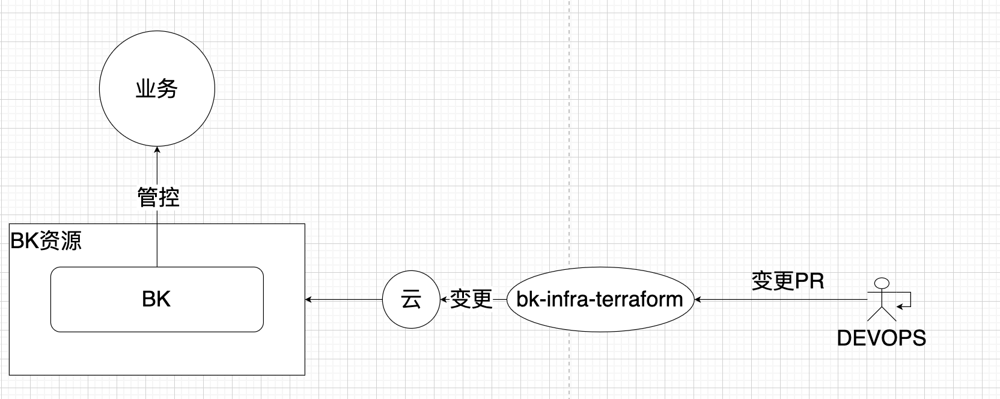

# BK infra terraform
> 只支持腾讯云 其他云厂商TODO

蓝鲸容器版本基础资源terraform仓库
本仓库支持蓝鲸容器版本基础资源初始化以及维护.
蓝鲸能够支持海量业务的运行和稳定,但是蓝鲸本身也需要维护和建设,本仓库设计和实现了一套基于terrafrom的基础资源管理蓝鲸的方式，使得蓝鲸在公有云上能够便捷的配置以及管理资源

# TODO
- 完善`LB`module
- argocd 维护蓝鲸容器化helmfile配置(待POC)
- 其他

# 目标
- gitops
- infra as code
- 变更可见

# 云基础网络配置管理
- 公共子网
- 私有子网
- NAT网关
- 跨VPC联通配置
# 中控机
> follow https://bk.tencent.com/docs/document/7.0/172/29311
- 中控机器申请以及初始化
- TODO
# 自建K8S
> follow https://bk.tencent.com/docs/document/7.0/172/14033
K8S module 按照蓝鲸文档进行建立，可以自动申请master机器并自动初始化
- master 机器初始化
- 腾讯云弹性伸缩自动扩缩机器
    - 分组管理 可以按需分配机器
    - control-plane
    - node
    - 支持LB绑定节点组
    - 注入node-labels(待支持 bcs.sh有问题)
# TKE
腾讯云TKE集群
- 集群初始化申请
- 节点池管理
    - 分组管理

# 工作流 change flow
- create new banrch
- update code
- create new PR
- terraform plan
- review
- apply plan after approve
- merge